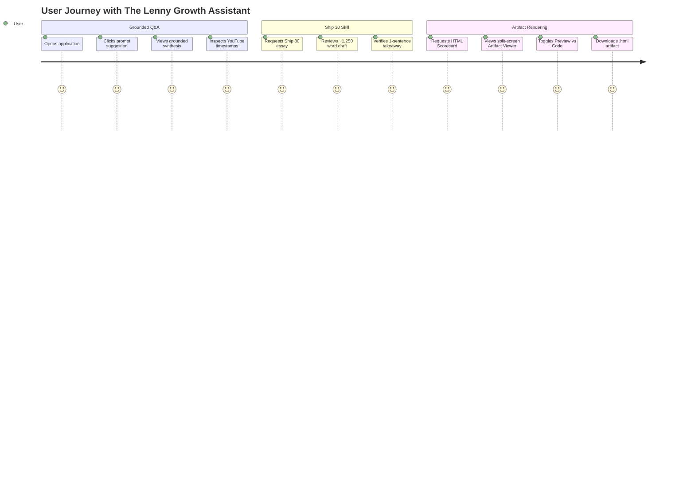

# Product Requirements Document (PRD): The Lenny Growth Assistant

**Role:** Forward Deployed Engineer (FDE)  
**Client:** Internal Product & Growth Team  
**Deliverable Status:** Production Ready (Non-Docker Native Setup)  
**Date:** September 15, 2026  

---

## 1. Forward Deployment Discovery Brief

### 1.1 User and Problem
* **Primary Users:** Product managers, growth engineers, founders, and product marketing leads.
* **Core Job to be Done (JTBD):** When formulating product strategies, defining growth loops, evaluating retention benchmarks, or preparing executive communications, users need immediate, authoritative insights from world-class operators (Brian Chesky, Elena Verna, Marty Cagan, Shreyas Doshi, Gustaf Alstromer) without spending 10+ hours listening to podcast audio or reading through fragmented transcripts.
* **Pain Removed:**
  1. *Uncertainty & Hallucination:* Generic LLMs invent growth statistics or offer generic platitudes. Users need claims verified against authentic operator interviews with direct source citations and timestamps.
  2. *Formatting Friction:* Translating raw ideas into executive one-pagers or engaging public essays takes hours of manual synthesis.
  3. *Tool Sprawl:* Users previously had to juggle audio players, transcription search tools, and external word processors. The assistant integrates grounded Q&A, structured essay writing, and native visual artifact rendering into one unified surface.

### 1.2 Measurable Success Metrics
* **Groundedness / Source Attribution Rate:** $\ge 95\%$ of substantive claims in assistant responses contain direct citation markers linking to specific guests and podcast timestamps.
* **Zero-Hallucination Fallback:** $100\%$ refusal rate on queries unsupported by the knowledge base (e.g. quantum physics or recipes), offering an explicit, polite guidance message.
* **Ship 30 for 30 Rubric Compliance:** $\ge 90\%$ pass rate on automated structural checks (target ~1,250 words, hook present, 3+ subheadings, bullet lists with bold lead-ins, 1-sentence takeaway).
* **Evaluator Time-to-Hello-World:** $\le 60$ seconds to clone, launch (`.\run.ps1`), and view the running application on any machine with Python and Node installed.

### 1.3 Key Assumptions
1. **Curated Seed Representation:** Rather than ingesting all 300+ transcripts over hours of network bandwidth, the client prioritized an immediate, high-fidelity experience over a curated set of the top 5 high-impact product management episodes (Brian Chesky on leadership/founder mode, Elena Verna on growth tactics, Marty Cagan on empowered teams, Shreyas Doshi on high agency, and Gustaf Alstromer on PMF engines). The ingestion pipeline is built to scale idempotently across all 300+ episodes.
2. **Persistence Simplicity (Non-Docker):** Evaluators need to test the solution on varied hardware without requiring Docker daemons or local Postgres services. The application assumes a dual-engine architecture: PostgreSQL when `DATABASE_URL` is configured, and automatic fallback to native SQLite (`lenny_assistant.db`) when run locally.
3. **Implicit Single User / Team Environment:** In this engagement phase, user authentication (OAuth/SAML) is out-of-scope; sessions are isolated by UUID, allowing multiple independent concurrent chats.

### 1.4 Scope Choices
| Capability | In Scope? | Strategic Rationale |
|---|---|---|
| **Grounded Conversational RAG** | ✅ YES | Core client requirement; answers cite episode, guest, timestamp, and clickable YouTube URL. |
| **Ship 30 for 30 Essay Skill** | ✅ YES | Transforms grounded insights into high-impact, ~1,250-word structured essays with automated rubric verification. |
| **Native Artifact Viewer** | ✅ YES | Renders interactive HTML/CSS and Markdown side-by-side with chat; features iframe sandboxing to prevent script execution. |
| **LLM Provider Abstraction** | ✅ YES | Supports Anthropic Claude, OpenAI, local Ollama, and an Offline Simulated Mode for immediate zero-key testing. |
| **Non-Docker 1-Command Startup** | ✅ YES | PowerShell (`run.ps1`) and Bash (`run.sh`) ensure immediate reproducibility without container overhead. |
| **Multi-Tenant User Auth & RBAC** | ❌ NO | Adds configuration friction for evaluators; UUID session isolation fully demonstrates state management without login walls. |
| **Full 300+ Episode Ingestion** | ❌ NO | Network and embedding compute constraints; architecture is proven on 568 chunks and includes the idempotent loader. |
| **Streaming Token SSE** | ❌ NO | Prioritized bulletproof session persistence, artifact rendering, and citation extraction over partial streaming tokens. |

### 1.5 Risk Register & Mitigations
| Risk | Severity | Implemented Mitigation |
|---|---|---|
| **Hallucination on unsupported topics** | HIGH | Hybrid retrieval with confidence thresholding (`is_insufficient_context`). When relevance score is below threshold, agent explicitly states lack of context rather than inventing claims. |
| **Local model (Ollama) absence / failure** | HIGH | Included a deterministic `SimulatedProvider` in the factory. Evaluators can test every UI feature, citation, and artifact with zero API keys or external services. |
| **XSS from generated HTML artifacts** | CRITICAL | Defense-in-depth: Server-side sanitization regexes strip `<script>` tags, inline event handlers (`onerror=`, `onload=`), and `javascript:` URIs. Client-side iframe enforces `sandbox="allow-same-origin"` without `allow-scripts`, and the raw endpoint sets strict `Content-Security-Policy`. |
| **Data leakage across user sessions** | MEDIUM | Strict SQL filtering by `session_id`; context window assemblies pull only messages and artifacts belonging to the active session. |
| **Database unavailability** | MEDIUM | Automatic fallback from PostgreSQL to native local SQLite (`lenny_assistant.db`), with pre-seeded chunks for zero downtime. |

---

## 2. Core User Flows

---

## 3. Detailed Acceptance Criteria

### AC 1: Grounded Conversational Assistant
* Given a user prompt about product leadership, the assistant retrieves relevant transcript chunks using cosine similarity over dense vector embeddings.
* Every assistant response citing transcript claims includes clickable citation chips that open the **Citations Drawer**.
* Each citation displays the guest name, episode title, timestamp string (`HH:MM:SS`), excerpt quote, and a direct YouTube jump-link with `?t=seconds`.
* If a user asks an unsupported question, the assistant states: *"I searched the transcripts from Lenny's Podcast, but there is not enough grounded material discussing..."*

### AC 2: Ship 30 for 30 Content Skill
* When a user requests an essay or mentions "Ship 30", the agent routes to the `ship30_skill`.
* The resulting essay is approximately 1,250 words (acceptable band: 1,000 - 1,400 words).
* Contains a single `# Headline`, a narrative hook, 3-5 Roman numeral subheadings (`### I.`, `### II.`, etc.), skimmable bullet points with bold highlights, and ends with `### The 1-Sentence Takeaway`.
* Includes programmatic rubric verification logged in structured telemetry.

### AC 3: Artifact Viewer & Security Isolation
* When requested to generate an artifact (one-pager, scorecard, HTML dashboard), the assistant produces a structured artifact and renders it in a split-screen pane beside the chat.
* The viewer allows toggling between **Preview** and **Source Code**, copying code to clipboard, and downloading as `.html` or `.md`.
* Generated HTML is treated as untrusted: rendered inside `<iframe sandbox="allow-same-origin">` without `allow-scripts` to eliminate XSS risks.

### AC 4: Flexible LLM Configuration & Resilience
* The active provider is clearly visible in the UI header via a status badge.
* Clicking the badge opens the provider modal, allowing live switching between `simulated`, `anthropic`, `openai`, and `ollama`.
* Switching providers updates future completions without requiring a server reboot.
* The `/readiness` endpoint reports database connectivity, total indexed chunks, and reachability of all providers.

---

## 4. Technical Constraints
* Must run natively on Windows/macOS/Linux without Docker.
* Frontend: React 18 with Vite, styled with custom Vanilla CSS (no Tailwind dependency).
* Backend: Python 3.10+ with FastAPI, SQLAlchemy, and Pydantic v2.
* Testing: 100% passing automated test suite via `pytest`.
