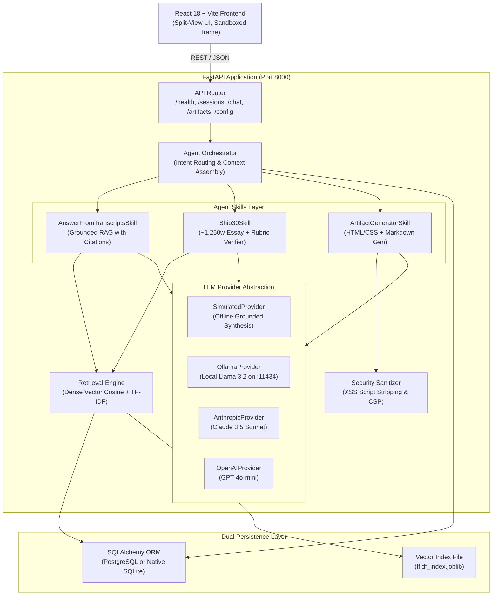
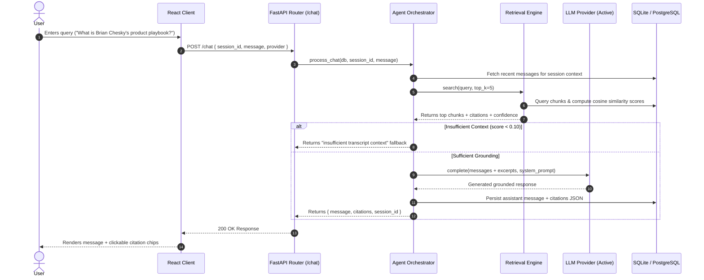
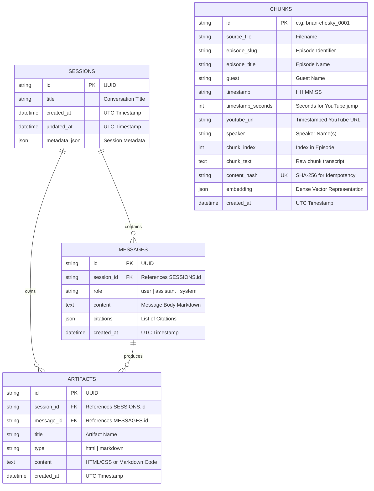

# System Architecture & Technical Specification: The Lenny Growth Assistant

**Deliverable 5:** Complete Technical Architecture Document  
**Target:** Production-Grade Forward Deployed AI System (Non-Docker Native & Cloud Ready)  

---

## 1. System Overview & Component Boundaries



---

## 2. Ingestion & Retrieval Pipeline



---

## 3. Database Schema & Data Models

The persistence layer uses **SQLAlchemy ORM**, operating identically on PostgreSQL (via `psycopg2` or Supabase) and zero-config local SQLite (`lenny_assistant.db`).



---

## 4. API Endpoints Specification

| Method | Path | Description | Request Payload | Response Schema |
|---|---|---|---|---|
| `GET` | `/health` | Liveness health check | None | `{ status: "ok", uptime_seconds: float, timestamp: string }` |
| `GET` | `/readiness` | Readiness check for DB and providers | None | `{ status: "ready", database_connected: bool, total_indexed_chunks: int, active_provider: str, providers_status: [] }` |
| `GET` | `/config` | Returns active provider without leaking secrets | None | `{ active_provider: str, active_model: str, database_url_masked: str, available_providers: [] }` |
| `POST` | `/config/provider` | Dynamically switches LLM engine | `{ provider: "ollama" }` | `{ status: "success", active_provider: str, model: str }` |
| `GET` | `/sessions` | Lists all chat sessions | None | `[ { id, title, created_at, updated_at, message_count } ]` |
| `POST` | `/sessions` | Creates an empty session | `{ title?: string }` | `{ id, title, created_at, updated_at }` |
| `GET` | `/sessions/{id}` | Retrieves session with messages and artifacts | None | `{ id, title, messages: [], artifacts: [] }` |
| `DELETE` | `/sessions/{id}` | Deletes session and associated messages | None | `{ status: "deleted", session_id: str }` |
| `POST` | `/chat` | Main grounded conversational endpoint | `{ message: str, session_id?: str, provider?: str }` | `{ session_id, message: {}, citations: [], artifact?: {}, rubric_verification?: {} }` |
| `POST` | `/artifacts` | Generates a standalone artifact | `{ session_id: str, prompt: str, type?: "html" }` | `{ id, session_id, title, type, content }` |
| `GET` | `/artifacts/{id}` | Fetches artifact metadata and code | None | `{ id, title, type, content, created_at }` |
| `GET` | `/artifacts/{id}/raw` | Serves raw HTML with CSP sandbox headers | None | Raw HTML document (`text/html`) |

---

## 5. Security & Untrusted Artifact Isolation Model

Because generated HTML originates from language model outputs, it must be treated as **untrusted data**. The Lenny Growth Assistant enforces a three-tier defense-in-depth isolation model:

```
┌────────────────────────────────────────────────────────────────────────┐
│                        DEFENSE-IN-DEPTH MODEL                          │
├────────────────────────────────────────────────────────────────────────┤
│ TIER 1: SERVER-SIDE SANITIZATION                                      │
│ - Regex scanning in app/core/sanitizer.py                              │
│ - Strips <script>, <object>, <embed>, <iframe> tags                    │
│ - Neutralizes inline event handlers (onerror=, onload=, onclick=)      │
│ - Rewrites javascript: pseudo-protocol URIs                            │
├────────────────────────────────────────────────────────────────────────┤
│ TIER 2: CLIENT-SIDE IFRAME SANDBOXING                                  │
│ - Rendered in ArtifactViewer using <iframe sandbox="allow-same-origin"> │
│ - Omission of 'allow-scripts' strictly blocks JavaScript execution    │
│ - Prevents cookie theft, localStorage access, and DOM hijacking        │
├────────────────────────────────────────────────────────────────────────┤
│ TIER 3: CONTENT SECURITY POLICY (CSP)                                  │
│ - Serves HTTP header on /artifacts/{id}/raw:                           │
│   default-src 'self' 'unsafe-inline' https://fonts.googleapis.com;    │
│   script-src 'none'; object-src 'none';                               │
└────────────────────────────────────────────────────────────────────────┘
```

---

## 6. Non-Docker Deployment Topology

The system is engineered for simple local execution while remaining cloud-deployable to platforms like Railway, Supabase, or AWS:

```
[Local Evaluator Machine]
  │
  ├─► PowerShell (run.ps1) / Bash (run.sh)
  │     │
  │     ├─► FastAPI (Uvicorn Worker) on http://127.0.0.1:8000
  │     │     ├─► Embedded SQLite (lenny_assistant.db)
  │     │     └─► Local Dense Vector Index (tfidf_index.joblib)
  │     │
  │     └─► Vite Dev Server on http://localhost:5173
  │           └─► Reverse proxy (/api -> http://localhost:8000)
```
